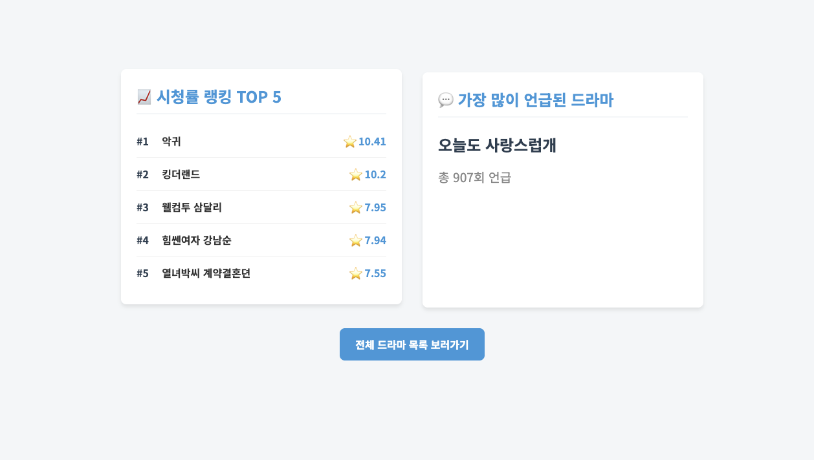
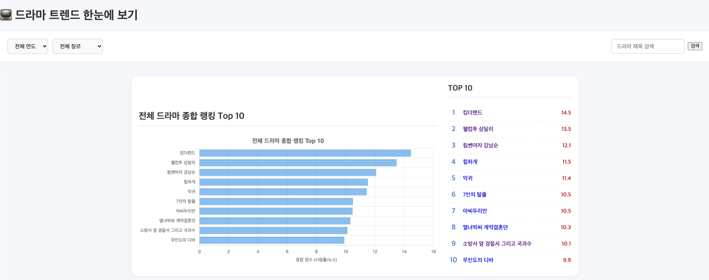
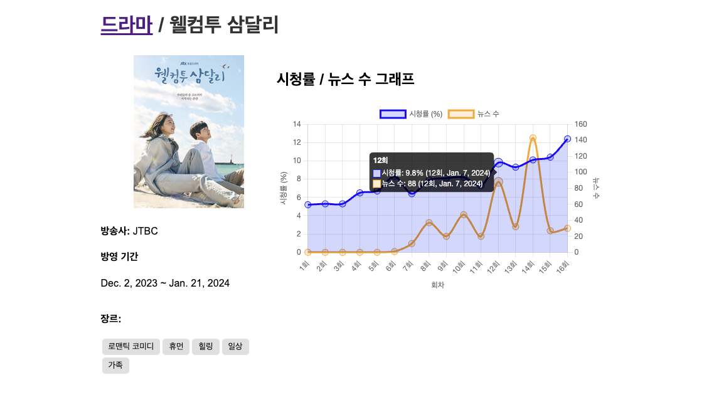
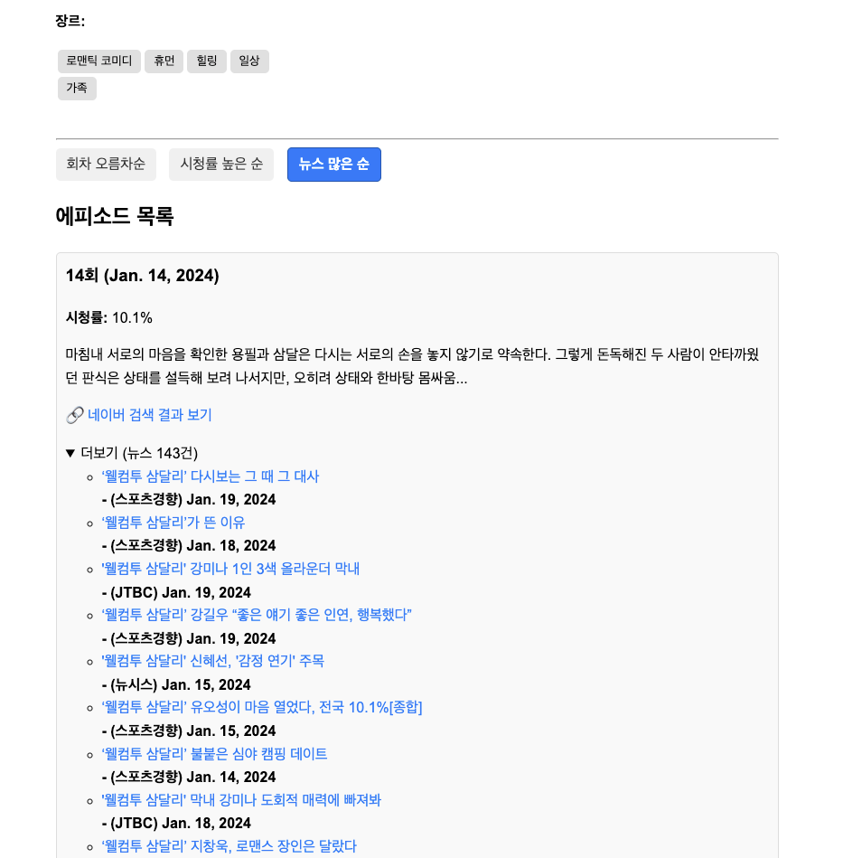
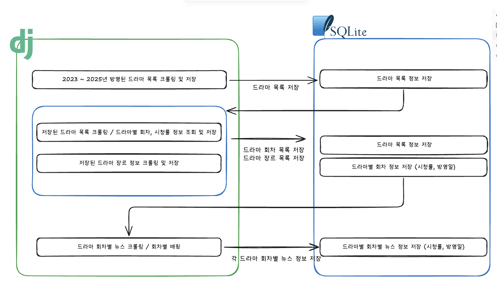
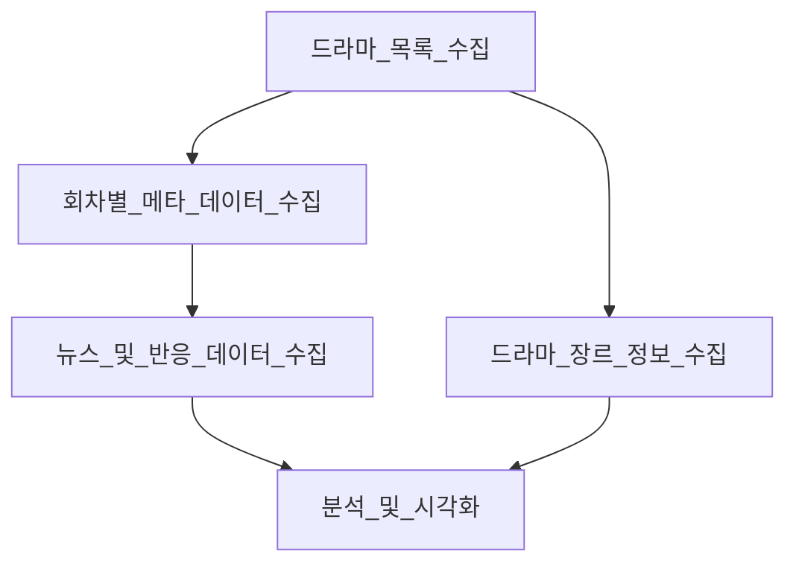

# 눈으로 보는 드라마 트렌드

## 📖 프로젝트 소개

> 눈으로 보는 드라마 트렌드는 드라마의 회차별 시청률, 뉴스 기사 수 등의 데이터를 크롤링하고 가공하여 드라마의 인기도를 산정하고,  
> 이를 시각화하여 제공하는 토이 프로젝트입니다. 사용자는 이 프로젝트를 통해 드라마 관련 트렌드를 직관적으로 파악하고,    
> 드라마 회차별 시계열 데이터를 기반으로 한 깊이 있는 인사이트를 얻을 수 있습니다.

### 💻 작업 화면






### 프로젝트 특징

- **시청률, 뉴스 연관관계 분석**: 드라마의 시청률과 뉴스 기사 수 간의 상관관계를 시각화하여 드라마의 인기 요인을 분석합니다.
- **드라마가 언급된 뉴스 목록 제공**: 각 드라마별로 언급된 뉴스와 어떤 회차에 언급되었는지 상세 정보를 제공합니다.
- **드라마 장르별 트렌드**: 장르별로 드라마의 인기도 변화를 비교 분석할 수 있습니다.
- **연도별 인기 드라마 분석**: 특정 연도에 방영된 드라마들의 인기도를 비교하여 연도별 트렌드를 파악할 수 있습니다.

### 수집 데이터

- **드라마 정보**: 제목, 방송사, 방영 기간, 장르 등
- **회차별 시청률**: 저장된 드라마를 기반으로 각 회차의 시청률, 상세 정보
- **장르 정보**: 드라마 장르별 분류 및 통계
- **뉴스 기사**: 드라마 관련 뉴스 기사 수, 기사 제목, 링크, 언급된 회차 등

### 주요 목표

- **데이터 기반 순위 산정**: 흩어져 있는 드라마 관련 데이터를 종합하여 객관적인 인기 순위를 제공합니다.
- **시각화를 통한 직관적 분석**: 복잡한 데이터를 차트와 그래프로 시각화하여 트렌드 변화를 쉽게 이해할 수 있도록 돕습니다.
- **인사이트 도출**: 드라마별 언급된 뉴스 목록과 회차별 시청률과 뉴스 기사 수 간의 상관관계를 시각화합니다.

## 🧑‍💻 팀원 소개 & Roles

|  |  |  |  |
|:-----------------------------------------------------------------------------------------:|:------------------------------------------------------------------------------------------:|:-----------------------------------------------------------------------------------------:|:-----------------------------------------------------------------------------------------:|
|                            [김동영](https://github.com/dongyi97)                             |                            [나시현](https://github.com/nasihyeon)                             |                            [배지환](https://github.com/jihwan20)                             |                            [정성길](https://github.com/seon99il)                             |

### 📑 주요 담당 업무

#### **김동영**

> 드라마 회차별 시청률 관련 크롤링/Frontend/시각화 담당
>
> [주요 기능 설명](/docs/dongyi97/code.md)  
> [Git History 보기](/docs/dongyi97/github.md)

- 드라마 회차별 시청률 크롤러 개발
- 드라마 회차별 시청률 데이터 시각화
- 드라마 회차별 상세 페이지 Front 개발

#### **나시현**

> 드라마 정보(2023~2024 종영작) 관련 크롤링/Frontend/시각화 담당
>
> [주요 기능 설명](/docs/nasihyeon/code.md)  
> [Git History 보기](/docs/nasihyeon/github.md)

- 2023 ~ 2024 드라마 목록 크롤러 개발
- 드라마 줄거리, 이미지 정보 크롤러 개발
- 드라마 목록 페이지 Front 개발

#### **배지환**

> 드라마 장르 정보 크롤링
>
> [주요 기능 설명](/docs/jihwan20/code.md)  
> [Git History 보기](/docs/jihwan20/github.md)

- 드라마 장르 정보 크롤러 개발
- 장르별 드라마 인기도 조회를 위한 DB 모델링

#### **정성길**

> 드라마가 언급된 뉴스 정보 크롤링
>
> [주요 기능 설명 - 비동기 처리를 활용하여 뉴스 크롤링 속도 개선](/docs/seon99il/code.md)  
> [Git History 보기](/docs/seon99il/github.md)

- 드라마 관련 뉴스 정보 크롤러 개발, 회차별 매핑 기능 개발
- 드라마가 언급된 뉴스 목록 조회 기능 개발
- 인덱스 페이지 Front 개발 (초기 데이터 셋업 기능, 시청률, 가장 많이 언급된 드라마)

## 🛠️ 기술 스택

### 크롤링

<div>
    
    
    
    
</div>

### 백엔드

<div>
    
    
    
</div>

### 시각화

[//]: # ()
<div>
    
    
    
</div>

### 인프라
<div>
    
    
    
    
</div>

---

## 🌊 데이터 수집 플로우





1. **드라마 목록 수집**
    - 네이버에서 연도별 종영 드라마 목록을 크롤링하여 기본적인 정보(제목, 방송사, 방영 기간)를 수집합니다.

2. **회차별 메타데이터 수집**
    - 수집된 드라마별로 회차 정보(회차 번호, 방영일, 시청률, 줄거리)를 크롤링합니다.
    - 드라마 장르 정보는 나무위키에서 크롤링하여 드라마 정보에 추가합니다.

3. **뉴스 및 반응 데이터 수집**
    - 각 드라마의 방영 기간을 기준으로 관련 뉴스 기사를 크롤링하여 화제성 데이터를 수집합니다.

4. **데이터 저장 및 가공**
    - 수집된 모든 데이터를 Django ORM을 통해 데이터베이스에 저장합니다.

5. **분석 및 시각화**
    - 저장된 데이터를 분석 및 가공하여 API를 통해 제공하고, 웹 페이지에서 차트와 그래프로 시각화합니다.

---

## 📊 데이터 시각화

본 프로젝트에서 제공할 데이터 시각화 뷰는 다음과 같이 정의됩니다.

|   시각화 종류   |           주요 데이터           | X축 (시간/대상) | Y축 (수치)  |     URL     |
|:----------:|:--------------------------:|:----------:|:--------:|:-----------:|
|   메인 페이지   | 시청률 랭킹 TOP5, 가장 많이 언급된 드라마 |     -      |    -     |      /      |
| 드라마 목록 페이지 |  드라마 종합 랭킹 (시청률, 언급 뉴스 수)  |     -      |    -     |   /dramas   |
| 드라마 상세 페이지 |       회차별 뉴스 언급량 추이        |  회차 및 방영일  | 언급한 뉴스 수 | /dramas/:id |
| 드라마 상세 페이지 |         회차별 시청률 변화         |  회차 및 방영일  | 시청률 (%)  | /dramas/:id |

---

## 📂 프로젝트 구조

```
/backend
├── src/
│   ├── backend/         # Django 프로젝트 설정
│   ├── common/          # 공통 유틸리티 (날짜 처리, 크롤러 헬퍼 등)
│   ├── dramas/          # 드라마, 회차 정보 관련 앱
│   │   └── management/commands/  # 드라마/회차 데이터 수집 명령어
│   ├── news/            # 뉴스 데이터 관련 앱
│   │   └── management/commands/  # 뉴스 데이터 수집 명령어
│   └── templates/       # HTML 템플릿
├── pyproject.toml       # 프로젝트 의존성 및 설정 (uv)
├── uv.lock              # 잠금 파일
└── README.md            # 프로젝트 안내 문서
```

---

## 🚀 시작하기

### 1. 프로젝트 클론

```bash
$ git clone https://github.com/your-username/your-repo-name.git
$ cd backend
```

### 2. 가상환경 설정 및 의존성 설치

이 프로젝트는 `uv`를 사용하여 가상환경 및 패키지를 관리합니다.

```bash
# uv 설치 (아직 설치하지 않은 경우)
$ pip install uv

# 가상환경 생성 및 활성화
$ uv venv
$ source .venv/bin/activate

# 의존성 패키지 설치
$ uv sync
```

### 3. 데이터베이스 마이그레이션

```bash
$ python src/manage.py migrate
```

### 4. 초기 데이터 설정 (크롤링)

> _아래 명령어를 실행하여 드라마, 회차, 뉴스 데이터를 한 번에 수집하고 데이터베이스를 설정합니다.  
> 이 과정은 네트워크 상태에 따라 몇 분 정도 소요될 수 있습니다._

_초기 데이터를 설정하지 않으면 http://127.0.0.1:8000/ 접속 시 자동으로 초기 데이터 설정이 시도됩니다._
```bash
$ python src/manage.py setup_data
```

`setup_data` 명령어는 다음 세 가지 명령을 순차적으로 실행합니다.

1. 드라마 기본 정보 크롤링 - (`crawl_dramas`, `crawl_dramas_desc`, `crawl_dramas_img`)
2. 드라마 회차 정보 크롤링 - (`crawler_episodes`)
3. 드라마 장르 정보 크롤링 - (`crawl_genre`)
4. 드라마 관련 뉴스 정보 크롤링 - (`crawl_news`)

### 5. 개발 서버 실행

모든 설정이 완료되면 개발 서버를 실행합니다.

```bash
$ python src/manage.py runserver
```

서버가 실행되면 웹 브라우저에서 `http://127.0.0.1:8000/` 으로 접속하여 결과를 확인할 수 있습니다
