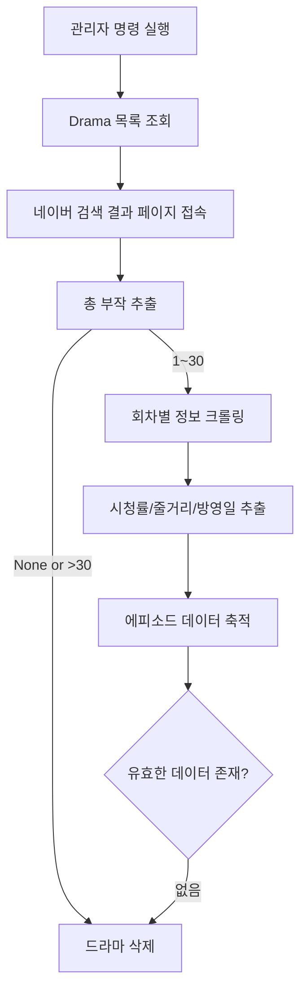

# 🎬 Naver Drama Episode Info Crawler

네이버 검색 결과와 “방송 에피소드” 모듈을 활용해  
드라마의 **총 부작, 방영일, 시청률, 줄거리**를 자동으로 수집하고  
Django 모델(`EpisodeInfo`)에 멱등하게 저장하는 크롤러입니다.

---

## 🚀 주요 기능

### 1️⃣ 총 부작 추출 (검색 결과 기반)
- 네이버 검색 결과 페이지에서 `em.state` 태그를 탐색해 총 회차(부작) 정보를 추출합니다.  
- HTML 구조 변경에 대비해 **3단계 XPATH 폴백(Fallback)** 을 적용했습니다.  
- 총 부작이 없거나 30회를 초과하는 경우 비정상 데이터로 간주하여 스킵합니다.

### 2️⃣ 회차별 세부 정보 크롤링
- `<드라마 제목> <n회>` 형태로 네이버에서 검색 후,  
  “방송 에피소드” 모듈(`_kgs_broadcast_episode`)에서 **방영일, 시청률, 줄거리**를 추출합니다.
- 시청률의 `%`는 제거하고, 방영일은 `YYYY.MM.DD → YYYY-MM-DD` 형식으로 변환합니다.
- 각 필드가 누락되면 `None`으로 채워 **부분 실패 허용**이 가능합니다.

### 3️⃣ 안정적 로딩 및 비가시 크롤링
- `WebDriverWait`을 사용해 요소 로딩을 보장합니다.  
- Chrome Headless 모드를 사용하여 창을 띄우지 않고 빠르게 크롤링합니다.  
- 한 드라마당 단일 `webdriver.Chrome` 세션을 재사용하여 **성능을 최적화**했습니다.

### 4️⃣ Django DB 연동 및 멱등성 보장
- `EpisodeInfo.objects.update_or_create()`를 사용하여  
  (drama, episode_no) 조합으로 중복 없이 **업데이트 또는 신규 저장**을 수행합니다.  
- 모든 값이 `None`이거나 방영정보가 없는 경우 **해당 드라마를 삭제**합니다.

---

## 🧩 전체 구조


## 📂 코드 구성

### `episode_info_crawler.py`

> 네이버에서 드라마의 **총 부작, 회차별 방영일/시청률/줄거리**를 크롤링합니다.

#### ▪ `extract_drama_meta_from_result_page(driver)`
- 검색 결과 페이지에서 `em.state`를 탐색해 **총 부작(회차 수)** 추출  
- 다중 XPATH 셀렉터로 안정성 확보  
- 예시 반환: `{"총부작": 16}`

#### ▪ `get_episode_rating_and_synopsis(driver, drama_title, episode_no)`
- `<드라마명> n회` 검색 → 방송 에피소드 모듈(`_kgs_broadcast_episode`) 파싱  
- **시청률(% 제거)**, **줄거리**, **방영일(YYYY-MM-DD)** 추출  
- 요소가 없으면 `None`으로 처리  
- 예시 반환:
  ```python
  {"episode_no": 3, "rating": "7.2", "date": "2024-03-20", "synopsis": "..."}

    H -->|있음| I[Django update_or_create 저장];
    I --> J[다음 드라마로 반복];
  ```

  ## ⚡ 개선 제안: 비동기 기반 속도 향상

현재 크롤러는 Selenium을 이용해 **드라마별로 순차적으로** 페이지를 요청하고 있습니다.  
이 과정에서 I/O 대기(페이지 로딩, HTML 파싱) 시간이 길어 전체 처리 속도가 느려집니다.  
이를 **비동기(Async) 방식**으로 개선하면 전체 크롤링 속도를 크게 높일 수 있습니다.

---

### 1️⃣ 문제점

| 구분 | 내용 |
|------|------|
| **동기 처리 구조** | 한 드라마가 끝나야 다음 드라마 크롤링 시작 |
| **I/O 대기 시간** | Selenium이 페이지를 로드할 때마다 블로킹 발생 |
| **CPU 낭비** | 네트워크 응답을 기다리는 동안 CPU가 유휴 상태 |

---

### 2️⃣ 개선 아이디어

#### ✅ (1) 드라마 단위 비동기 병렬 처리

#### ✅ (2) Selenium → requests/httpx 전환

#### ✅ (3) DB 저장 병렬화
