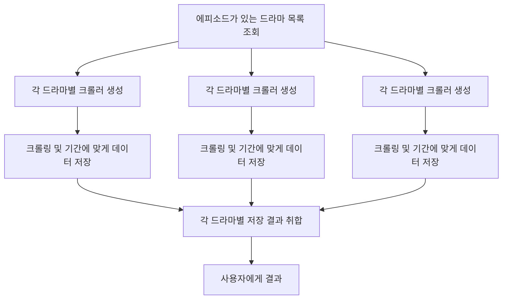

# Naver Drama News Crawler

앞에서 크롤링한 드라마 회차별 정보를 기반으로 네이버 뉴스 정보를 **네이버 뉴스 검색 API**를 활용해 크롤링 하는 기능을 개발했습니다.  
특히, **무한 스크롤 대응**, **이터레이터 기반 멱등 처리**, **크롤링 속도 향상을 위한 드라마별 비동기 처리**를 통해 효율적이고 안정적인 크롤링을 제공합니다

---

## 주요 기능

### 1. 무한 스크롤 대응 (Zero-offset 처리) - API 분석

> `https://s.search.naver.com/p/newssearch/3/api/tab/more` 에 query, ds(start), de(end), start(다음 뉴스
> 번호)
> 파라미터를 활용해 뉴스 검색 결과를 페이지 단위로 요청이 가능한 API이며 response로 오는 HTML 소스와 next_url을 활용해
> 다음 페이지를 요청하고 뉴스 정보를 크롤링할 수 있습니다.

- `start` 파라미터와 API 응답 내 `next_url`을 활용해 페이지를 순차적으로 요청하며 모든 뉴스 데이터 수집.
- 다음 페이지가 없으면 멈추도록 `StopAsyncIteration`을 통해 자연스러운 반복 종료 처리.

### 2. 이터레이터 패턴 기반 멱등 처리

> 하나의 드라마를 대상으로 페이지를 순차적으로 요청하며 뉴스 데이터를 수집하는 작업을 이터레이터 패턴으로 구현했습니다.
> 이를 통해 드라마별 뉴스 수집 작업이 멱등성을 유지하며, 재시도 시에도 안전하게 처리할 수 있습니다.

- `NaverNewsCrawler`는 비동기 이터레이터(`__aiter__` / `__anext__`)를 구현.
- 드라마별 이미 수집한 뉴스 링크를 `saved_links` 집합으로 관리해 **중복 저장 방지**.
- 한 드라마의 뉴스 수집 작업이 페이지 단위로 재실행 되지 않고 멱등성을 유지하며, 재시도 시에도 안전하게 처리 가능.
- 드라마 회차 및 뉴스 링크를 기반으로 중복 뉴스 저장 방지.

### 3. 드라마별 비동기 통합 처리 - Trouble Shooting

> 약 200개의 드라마에 대해 최소 20페이지 이상의 뉴스를 수집해야 하여 동기적으로 처리할 경우 시간이 오래걸리는 이슈가 있었습니다.
>
> 이를 해결하기 위해 드라마별 뉴스 수집 작업을 비동기적으로 병렬 처리하도록 개선했습니다.
>
> 또한 각 페이지에 대해 비동기 HTTP 요청을 통해 크롤링 속도를 더욱 향상시켰습니다.

- 단일 드라마 처리 시 동기적 뉴스 요청은 시간이 오래 걸리는 이슈 발생.
- `crawl_all_dramas`에서 `asyncio.gather`를 사용해 **모든 드라마 뉴스 수집 작업을 병렬 처리**.
- 각 드라마별 뉴스가 완료되면 DB에 저장하며, 완료/실패 결과를 별도로 반환.
- `httpx.AsyncClient()`를 활용해 각 페이지 요청을 비동기 HTTP 요청으로 처리, 크롤링 속도 향상.

---

### 전체 플로우



## 코드 구조 및 설명

```python
async def main():
        dramas = await get_dramas_with_episodes_async()
        completed, failed = await crawl_all_dramas(dramas)
        return completed, failed

    completed_results, failed_results = asyncio.run(main())
```

### 1. [NaverNewsCrawler (crawler)](https://github.com/devcourse-de7-1-team-5/backend/blob/dev/src/news/crawler.py)

- 무한 스크롤 대응  
  next_url과 params를 업데이트하며 페이지 단위 뉴스 요청
- 이터레이터 패턴  
  __aiter__ / __anext__를 통해 async for 반복 가능
- 뉴스 파싱  
  BeautifulSoup을 이용해 뉴스 제목, 내용, 날짜, 언론사, 링크 등 추출

```python
def __aiter__(self):
    return self


async def __anext__(self) -> List[NaverNewsItem]:
    if not self.has_next_page():
        raise StopAsyncIteration("No more pages to fetch.")
    return await self._fetch_next()
```

## 2. crawl_single_drama (views)

> 각 드라마별 크롤러 객체를 생성 후 마지막 페이지까지 뉴스 수집 후 저장합니다

- 에피소드별 기간을 계산하여 해당 기간 뉴스만 저장
- 에피소드별 기간: 드라마 에피소드 방영일부터 다음 에피소드가 방영되기 전날까지

```python
@sync_to_async
def get_episode_periods_async(drama):
    """드라마의 에피소드별 뉴스 수집 기간 계산"""
    episodes = list(drama.episodes.order_by("episode_no"))
    periods = []
    for i, ep in enumerate(episodes):
        start = ep.date
        end = episodes[i + 1].date - timedelta(days=1) if i < len(
            episodes) - 1 else drama.end_date
        periods.append((ep, start, end))
    return periods
```

```python
async def crawl_single_drama(drama):
    """한 드라마의 뉴스를 크롤링하고 DB에 저장 후, 뉴스 개수를 반환"""
    print("start:", drama.title)
    episode_periods = await get_episode_periods_async(drama)

    crawler = NaverNewsCrawler(
        query=drama.title,
        ds=drama.start_date.strftime("%Y.%m.%d"),
        de=drama.end_date.strftime("%Y.%m.%d"),
        start='0'
    )

    news_models = []
    saved_links = set()  # 중복 뉴스 링크를 `saved_links` 집합으로 관리하여 중복 저장 방지
    async for page in crawler:
        for news in page:
            for ep, start, end in episode_periods:
                if news.link in saved_links:
                    continue
                if news.date and start <= news.date <= end:
                    news_models.append(
                        News(
                            title=news.title,
                            content=news.content,
                            date=news.date,
                            press=news.press,
                            link=news.link,
                            drama_ep=ep,
                        )
                    )
                    saved_links.add(news.link)
                    break

    if news_models:
        await bulk_create_news_async(news_models)

    print("completed:", drama.title, len(news_models))

    return len(news_models)
```

## 3. crawl_all_dramas (views)

- 드라마 목록을 받아 병렬 비동기 처리
- 결과를 완료/실패로 분리하여 반환

```python
async def crawl_all_dramas(dramas):
    tasks = [crawl_single_drama(drama) for drama in dramas]
    results = await asyncio.gather(*tasks, return_exceptions=True)
```
